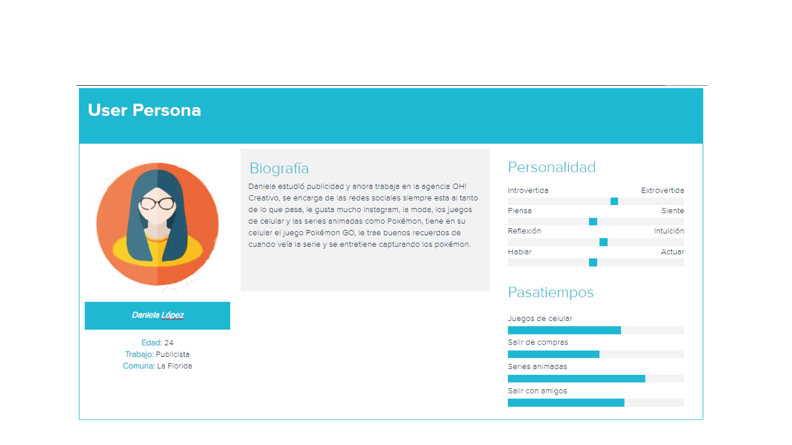
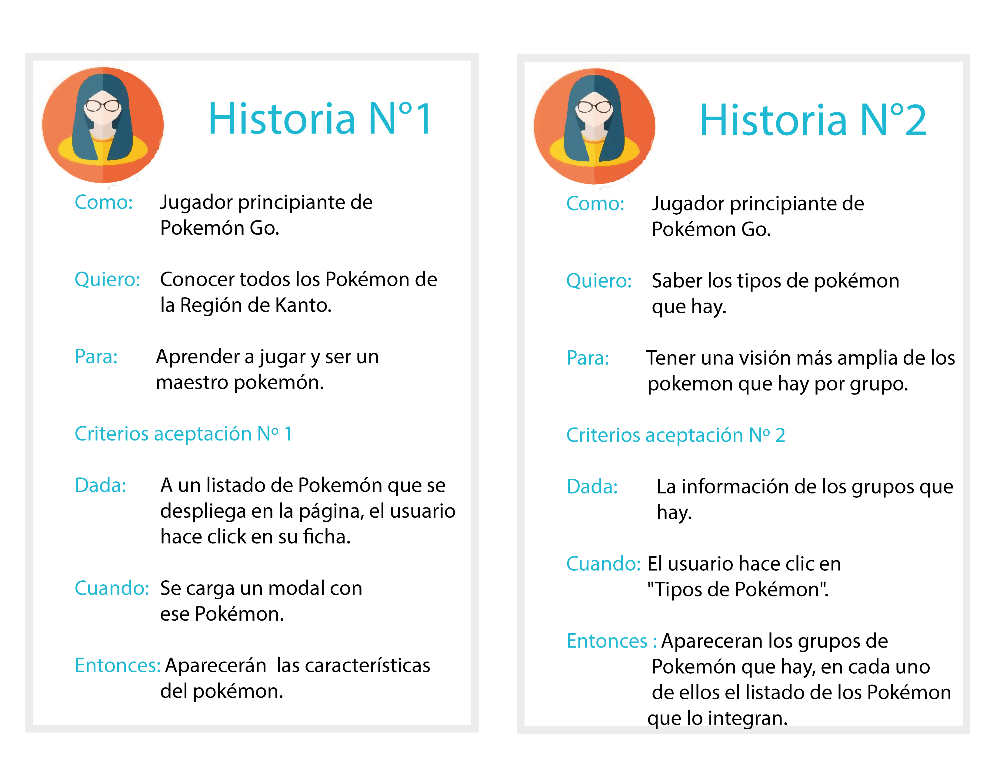
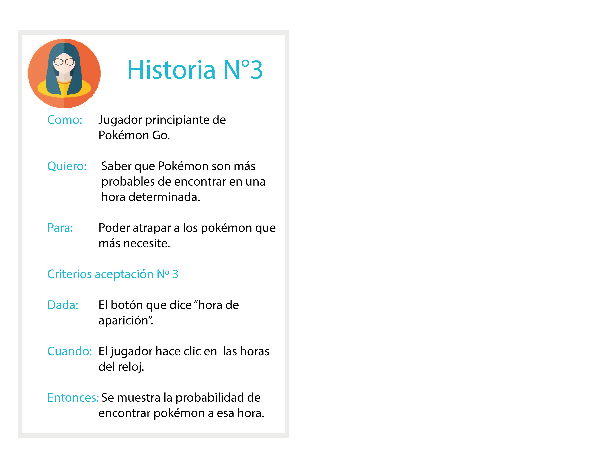
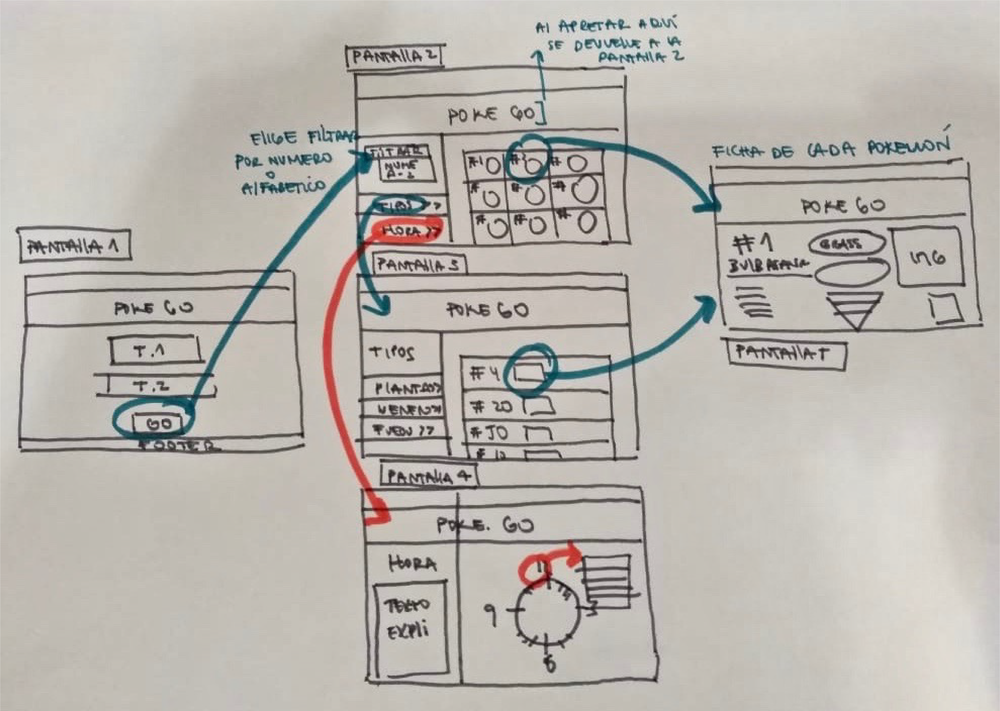
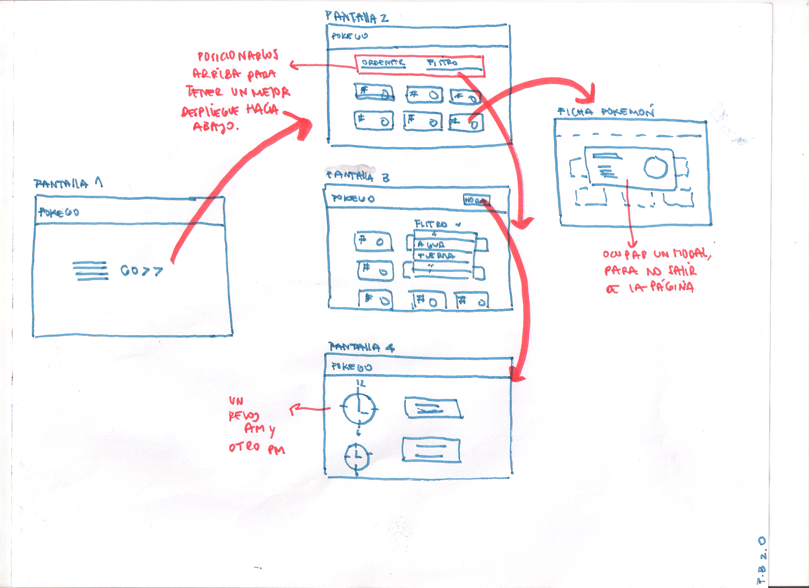
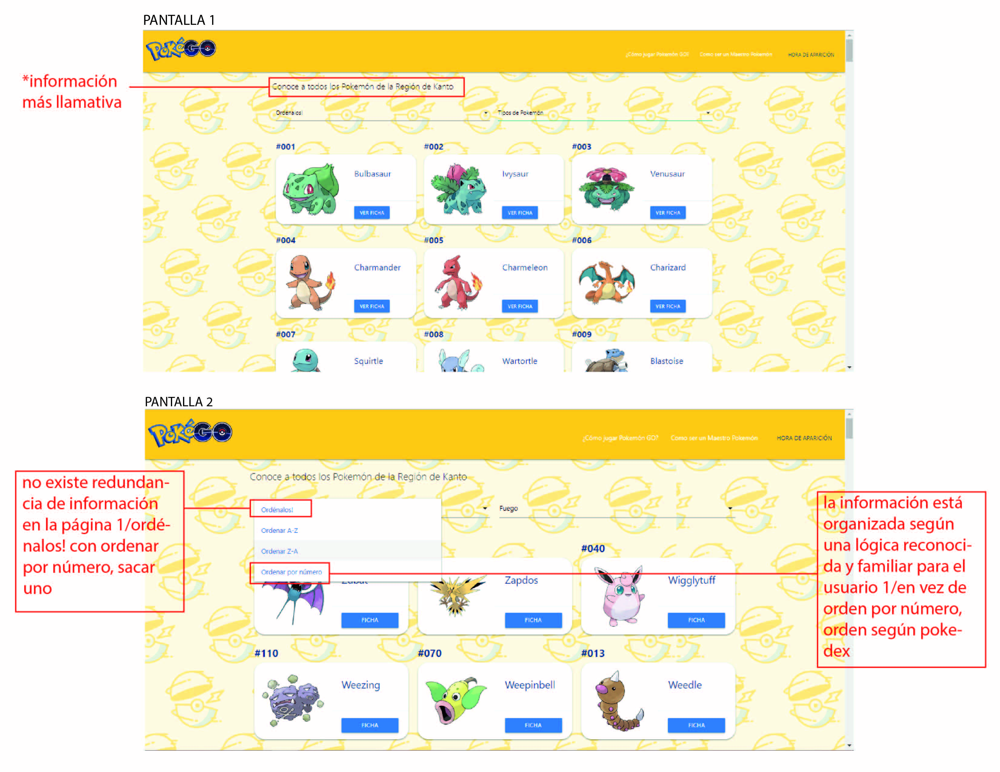
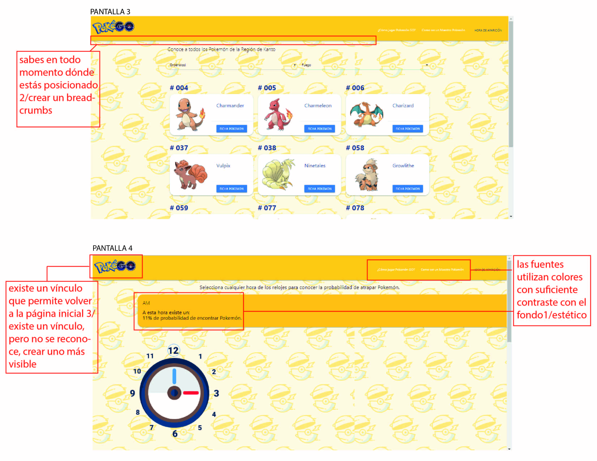
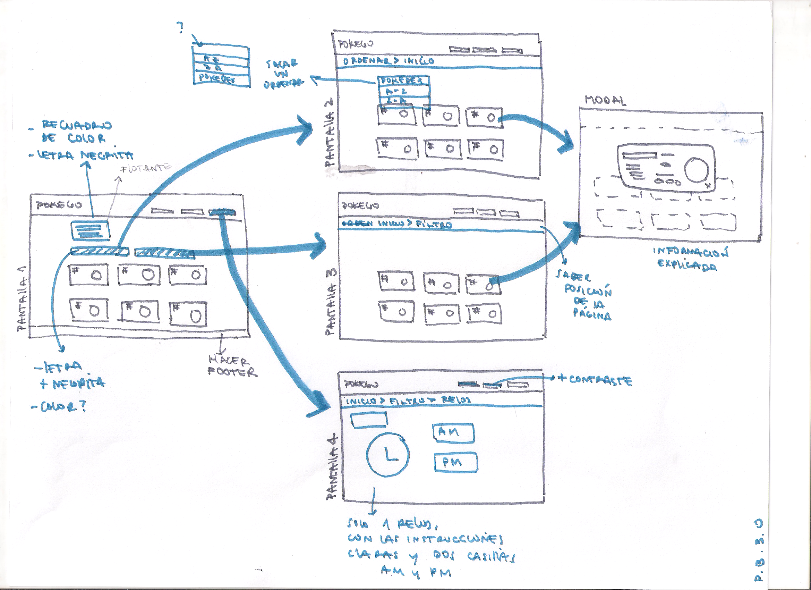

# POKÉGO

## **1.Descripción**
PokeGo es una página web enfocada a personas que están empezando a jugar Pokémon GO, acá encontrarán información relevante sobre los pokémon de la región de Kanto que los ayudará a ser un mejor maestro pokémon.

## **2.Definición de usuario**
Según un estudio realizado por  SurveyMonkey Intelligence [(link)](https://pokemaster.es/quienes-juegan-mas-a-pokemon-go-no-98238/)
las personas entre 18 y 30 años son las que más juegan cubriendo un 46% del total, otro dato es que 63% de los jugadores son mujeres, basándonos en estos datos y [encuestas](https://docs.google.com/document/d/1xwDvc6MG8ALrfxSsE2eRgYUtpB45hKrrdzfmq3OVdok/edit?usp=sharing) que se hicieron definimos un user person:

## **3.Necesidad del usuario**
Al comenzar a jugar Pokémon Go las principales necesidades son:

 **1**: Conocer todos los pokémon de la región de Kanto

 **2**: Saber que tipo son

 **3**: Conocer las debilidades de cada pokémon

 **4**: Saber cual atrapar(arreglar)

## **4.Historia de Usuario**

## **5.Definición de Terminado**
Historia Nº 1

* Al ingresar a la página principal el usuario hará clic en GO! para conocer a los pokémon.
* Aparece el listado de imagenes de todos los pokémon ordenados por número.
* En la parte superior de la pagina habrá un "select" donde aparece la opción de ordenar el listado de pokemones por alfabeto, que puede ser desde la A/Z o Z/A y por número.
* El usuario al hacer click en una imagen tendrá la posibilidad de conocer la ficha técnica/descriptiva del pokemon.

Historia Nº 2

* Abrir el select "Tipos de Pokemon" haciendo click.
* Se despliegan las categoría que hay de Pokemón.
* El usuario debe seleccionar la categoria que quiere al hacer clic.
* Al hacer clic va a aparecer los Pokémon del tipo seleccionado.

Historia Nº 3

* En la parte superior de la página habrá un botón con el nombre de "hora de aparición"
* Al hacer clic en el boton aparece una nueva página.
* En la página estará la imagen de un reloj donde el usuario posiciona el cursor sobre una hora determinada y se mostrará el listado de pokémon que aparecen en esa hora.

## **6.Ideación de Diseño**

Para definir el contenido y estructura de nuestra interfaz comenzamos investigando otras páginas web para saber de que manera nos podríamos diferenciar y además realizamos entrevistas a jugadores de Pokémon Go!.

(Sabiendo que la mayoría de jugadores crecieron en la década de los noventa, la nostalgia por la Primera Generación de Pokémon ha cumplido un papel importante para obtener estos resultados.)

PokéGo es una página web dirigida a jóvenes principiantes que están interesados en conocer los 151 pokémon de la región de Kanto, mediante nuestra página podrán acceder a una ficha informativa de cada uno de ellos (dónde se detalla sus debilidades, tipo, peso, etc.), obtener información adicional para ser un maestro Pokémon y saber la cantidad de Pokémon que aparecen por hora. 

Algunas páginas visitadas:

[Página 1](https://db.pokemongohub.net/pokemon-list/type-ground)

[Página 2](https://es.wikihow.com/jugar-Pok%C3%A9mon-GO)

[Página 3](http://es.pokemon.wikia.com/wiki/Tipo_planta)

### **1.0 Prototipo baja fidelidad**
Diseñamos un prototipo de página que consta de tres pantalla, la primera es de bienvenida y con un botón "GO" el usuario podrá interactuar con la información que desea obtener. La segunda pantalla es donde se despliega todos los pokemones donde el usuario puede ordenar los 151 pokemones por orden alfabetico ascendente y descendente y por número, tambien mostraremos la opción de que pueda tener más información sobre ser un maestro pokémon, guía de como jugar PokémonGo! y saber la cantidad de pokémon que aparecen por hora durante el día. Éste último es la tercera pantalla donde lo vamos a interactuar con un reloj.

En esta imagen se muestra el prototipo de flujo de la página

 **Flujo interactivo de PokéGO!*
 

### **1.0 Prototipo alta fidelidad**
Luego de analizar nuestro prototipo de baja, diseñamos nuestro prototipo de alta en Figma y lo exportamos a Zeplin.

[Ver prototipo 1.0 en alta en Figma](https://www.figma.com/proto/NZ8W3KBrc3oz3UcEUSb8PIuo/PokeGO?node-id=0%3A1&scaling=scale-down)

[Exportación del proyecto de Figma a Zeplin](https://zpl.io/29oOzrw)

### **1.0 Fundamentos visual design**
* Selección de imagenes: se les mostró a los usuarios dos opciones de las imagenes de los pokémon, la mayoría elegió las que seguían una linea estilo "cartoon" ya que les recordaba a la serie de pokémon, generando un "vínculo nostalgico".

* Se colocaron al lado derecho las acciones para que fueram más fáciles de leer.

* Paleta de colores usada en la interfaz esta basada en el logo clásico:

### **1.0 Testeo de usabilidad**
[Ver videos](https://drive.google.com/open?id=1nNqfTYAbFsNpYdYQ9CfZk9gEljz8zeqS)

### **1.0 Observaciones**
Las observaciones que tuvimos de los usuarios frente a nuestro prototipo de pagina web fue:

**Que la primera pantalla no la encuentran necesaria, prefieren acceder más rapido a la información.*

**Que en la ficha descriptiva de cada pokemon los llevará a otra página encontraron también que no es necesario.*

**Les gustó que las debilidades aparezcan en colores (más visual) que solo nombrarlos.*

Tomando en cuenta las observaciones, se realizó un segundo prototipo con mejoras.
### **2.0 Prototipo baja fidelidad**
En esta imagen se muestra el protitpo de flujo 2.0
 

### **2.0 Prototipo alta fidelidad**

[Ver prototipo 2.0 en alta ](https://camilanavarreteivanoff.github.io/scl-2018-12-bc-core-data-lovers/#)

### **2.0 Testeo de usabilidad**
Se realizó el test a un número de personas que llevan poco tiempo jugando pokemon go y personas que recién quieren iniciarse en el juego,
se les pidió que recorrieran la página libre y realizarán algunas de las siguientes tareas:

1.”Encuentra que tipos de pokemon son tierra”

2.”Encontrar las debilidades de algún pokémon”

3.”Encontrar un pokémon en específico”

[Ver las respuestas](https://docs.google.com/document/d/1SHW6nQKEyKPiukdMgKILSpOb7P9-3Htug1bDkXdBh9I/edit)

[Ver videos del test de usabilidad](https://drive.google.com/open?id=1AtTRhHh0zzLgukWTWWXlyHNvXAnXuuDE)

### **2.0 Evaluación Heurística**

[Ver puntuación y punto a corregir](https://drive.google.com/open?id=1KMfPza3shog9NOvFxWa5nGfteY_bgHkx)

### **2.0 Observaciones para mejoras**
**Luego de ordenarlos por tipo, quiso ordenar solo los de tierra por orden alfabético, esa opción no está disponible.*

**Cuando quiso devolverse al inicio, no encontró ningún botón para realizar la acción, no hizo clic sobre el logo el cual devuelve al inicio.*

**Encontró fácilmente las fichas, comentó que le serviría esa información al momento de combatir en el gimnasio.*

**Comenta que le sería más fácil encontrar un pokemon con un buscador,que complete el nombre del pokemon.*

**Comenta que le gustaría ver las evoluciones de los pokemones.*

**Comenta que la información de la región de kanto podría estar más llamativa.*

Puntos críticos
 
 

Tomando en cuenta las observaciones, se realizó un tercer prototipo con mejoras.
## **3.0 Prototipo baja fidelidad**
En esta imagen se muestra el protitpo de flujo 3.0

 

## **3.0 Prototipo alta fidelidad**

[Ver prototipo 3.0 en alta en Figma](https://www.figma.com/proto/SX7K5ML2kkX3uOv5ygX7MD3s/PokeGo-3.0?node-id=13%3A168&scaling=min-zoom)

### **Actualización**
Siguiendo con los testeos, la página web tendra una actualización pronto.

### **Planificación**

[Trello PokeGO!](https://trello.com/b/J9VDuFEc/pokemon-go)

[Trello data-lovers UX!](https://trello.com/b/gabUfphD/data-lovers-ux)
